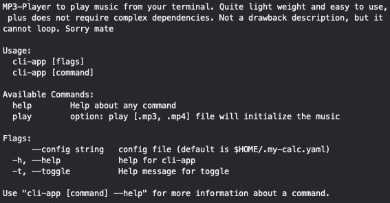

# MP3-PLAYER BY NICK1819

## Platforms

- Windows
- macOS
- Linux

## Installation

First, clone this repo to your computer (pre-installed Go v1.1.0+)

```sh
go get github.com/Nick1819/cli-app
```

Then

```sh
go build
```

## USAGE

Type in this command for help:

```sh
./gmdc -h
```

Command options:


## CONTRIBUTION

Conact via: nickworkspace189@gmail.com

Thanks :x
